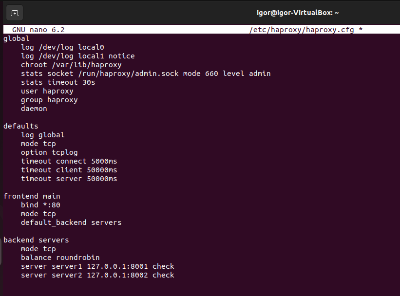
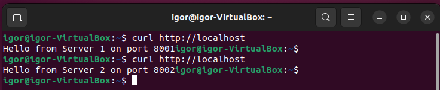
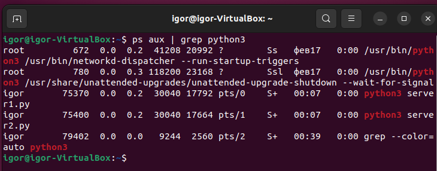
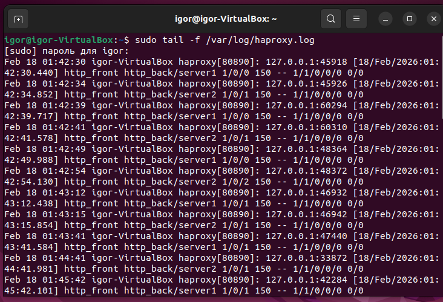
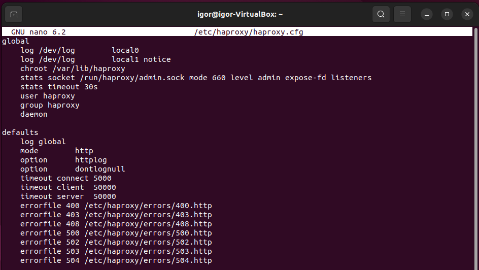
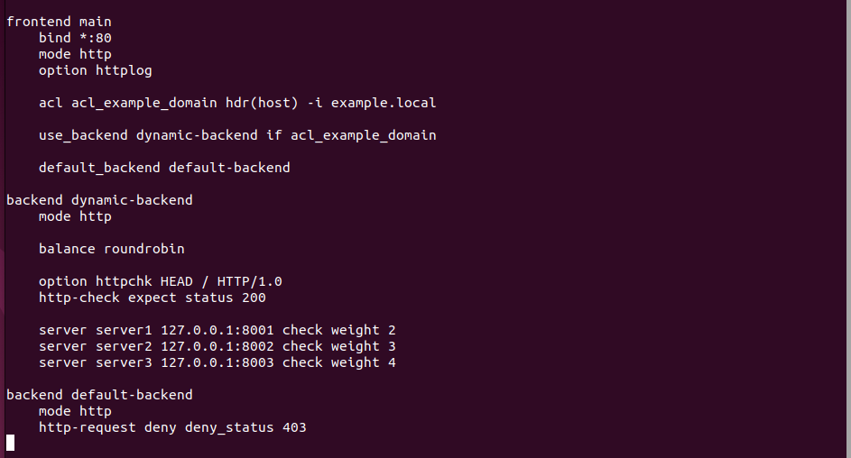
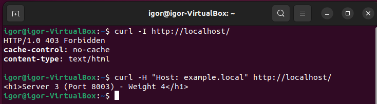
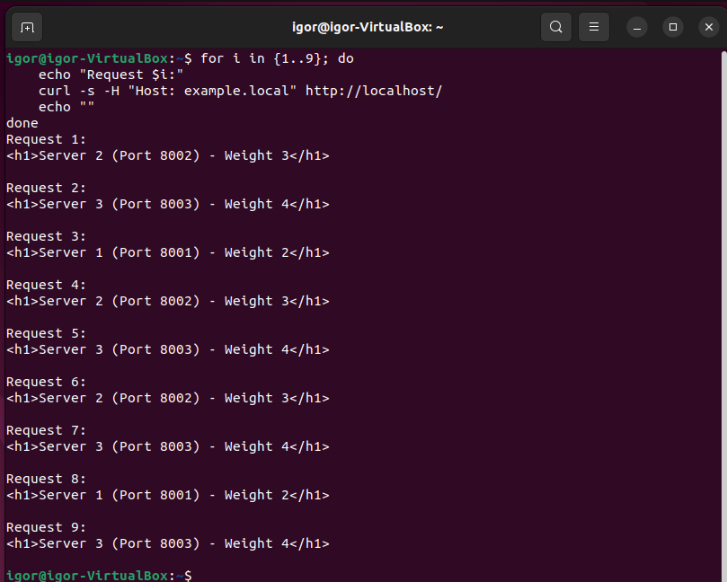

# Домашнее задание к занятию «Кластеризация и балансировка нагрузки»
Выполнил: Береснев Игорь Андреевич

---

## Задание 1. 

Запустите два simple python сервера на своей виртуальной машине на разных портах
Установите и настройте HAProxy, воспользуйтесь материалами к лекции по ссылке
Настройте балансировку Round-robin на 4 уровне.
На проверку направьте конфигурационный файл haproxy, скриншоты, где видно перенаправление запросов на разные серверы при обращении к HAProxy.

### 1.1 Скриншот конфига haproxy

### 1.2 Скриншот работа балансировки Round-robin

### 1.3 Скришнот Два запущенных Python сервера

### 1.4 Логи HAProxy — чередование запросов между server1 и server2

## Задание 2

Запустите три simple python сервера на своей виртуальной машине на разных портах
Настройте балансировку Weighted Round Robin на 7 уровне, чтобы первый сервер имел вес 2, второй - 3, а третий - 4
HAproxy должен балансировать только тот http-трафик, который адресован домену example.local
На проверку направьте конфигурационный файл haproxy, скриншоты, где видно перенаправление запросов на разные серверы при обращении к HAProxy c использованием домена example.local и без него.

### 2.1 Скриншот конфига haproxy

### 2.2 Скриншот Сравнение запросов с доменом example.local и без него

### 2.3 Скриншот Демонстрация работы Weighted Round Robin

